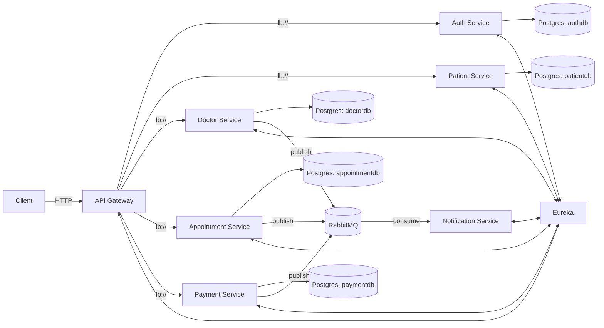
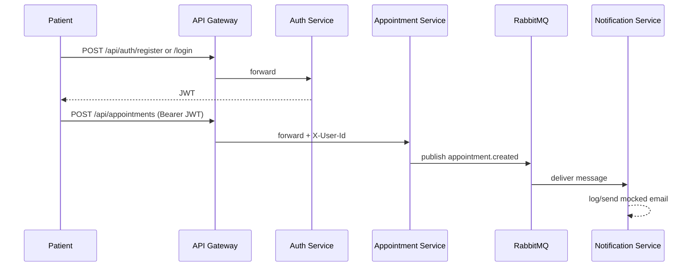

# MediLink LK – Architecture

## High-level architecture

- **API Gateway (Spring Cloud Gateway)**: single entry point, routing + JWT validation
- **Service Discovery (Eureka)**: dynamic service registry
- **Auth Service**: user registration/login, issues JWT
- **Patient Service (scaffold)**: placeholder service module + DB integration
- **Doctor Service**: onboarding + admin verification
- **Appointment Service**: appointment CRUD, publishes events
- **Payment Service**: payment intents + callback validation, publishes events
- **Notification Service**: consumes appointment events, emits notifications (mocked as logs)
- **RabbitMQ**: asynchronous event-driven communication
- **PostgreSQL**: per-service data ownership (Auth/Patient/Doctor/Appointment/Payment DBs)

## Diagrams (Mermaid)

### Component diagram

### Appointment booking workflow

